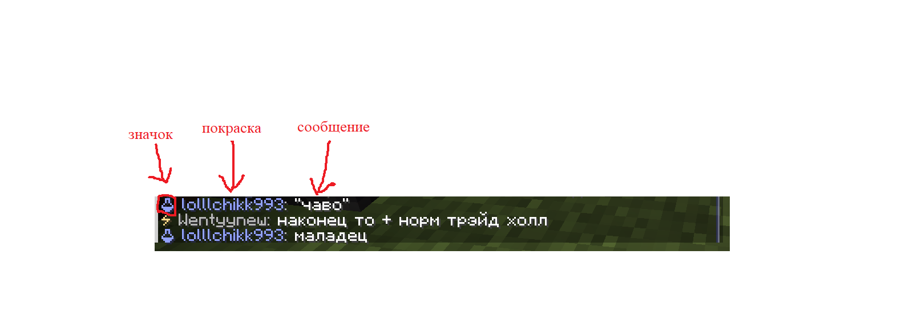
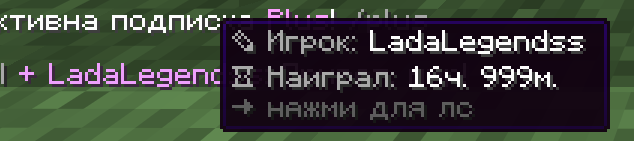

# Чат

### Виды чатов

* Глобальный чат (радиус: весь сервер; используйте "!" перед сообщением)
* Локальный чат (радиус: 70 блоков).

<figure><figcaption>
Разбор вида чата
</figcaption></figure>

### Функции чата

Всплывающие сообщения (баблы)

Баблы - это всплывающие сообщения из чата, которые отображаются над головой игрока. Баблы не выводяться, если у вас зелье невидимости или вы в режиме игры Наблюдатель.

<figure><figcaption></figcaption></figure>

Сообщения о достижениях и смертях (скоро)


Раздел находится в разработке..


Упоминания игроков

На нашем сервере присутвует возможность упомянуть практически любого онлайн игрока в чате.

### Как упомянуть игрока?

Для этого введите в чат точный никнейм игрока. Важно: игрок, которого вы хотите упомянуть, должен **видеть** ваше сообщение. Например, если вы отправите упоминание в **локальный** чат, а он находится далеко, то уведомление не сработает.

<figure><figcaption>
От лица того, кого упомянули
</figcaption></figure>

Личные сообщения

Личные сообщения нужны для разговора наедине с собеседником. Они не просматриваются администрацией

<figure><figcaption></figcaption></figure>

#### `/msg <player> <message>`

Отправить личное сообщение другому игроку.\
Альтернативы: `/tell`&#x20;

#### `/reply <message>`

Отправить личное сообщение последнему, кто писал Вам.\
Альтернативы: `/r`

Hover-компоненты (скоро)

Если навестись курсором в определенные уголки чата, можно увидеть всплывающее сообщение.&#x20;

#### Автор сообщения

Если навестись на никнейм автора сообщения в чате, то всплывет окно с информацией о нем.

<figure><figcaption></figcaption></figure>

#### Упоминание

Если навестись на @упоминание в чате, то всплывет окно с информацией об игроке, которого упомянули.

<figure><figcaption></figcaption></figure>

Модули чата (скоро)

Модули - ключевые слова, которые автоматически заменяются на определенную информацию.

#### \[xyz]

Показывает ваши текущие координаты в формате \[X, Y, Z].

<figure><figcaption></figcaption></figure>

#### \[item]

Показывает предмет, который вы держите в руке.

<figure><figcaption></figcaption></figure>

#### ссылка

Если ввести в чат любую не заблокированную ссылку, то она заменится на (ссылка). При клике по ссылке она откроется в браузере.

<figure><figcaption></figcaption></figure>

