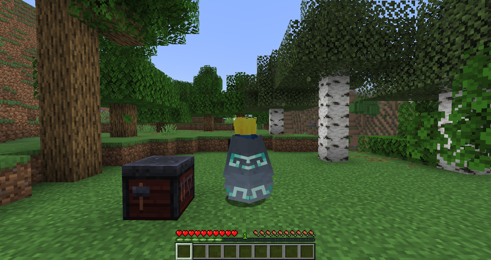

# Шаблоны кузнеца

<figure><figcaption>
Рецепт наложения отделки на элитру
</figcaption></figure>

<figure><figcaption>
Отображение алмазной отделки "Поток" на элитре (от третьего лица)
</figcaption></figure>


Для корректного отображения необходимо установить ресурспак "**VSresourcepack**" версии 1.0 и выше.

* Ссылка для скачивания: [https://t.me/vanillasuper\_radio/472](https://t.me/vanillasuper_radio/472)

