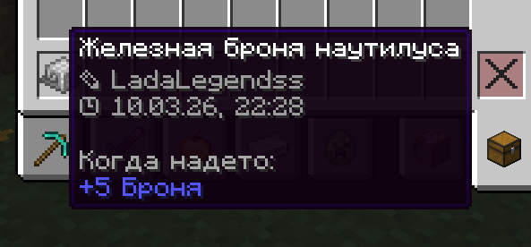

# Подпись предметов

## Как подписать предмет?

Для этого вам необходимо:

1. Взять в правую руку нужный предмет
2. Ввести команду /sign

<figure><figcaption></figcaption></figure>

Готово! Подпись также содержит в себе дату и время, когда предмет был подписан.

## Доступные команды:

* /sign - добавить подпись
* /unsign - снять подпись
* /sign check - проверить подлинность подписи
