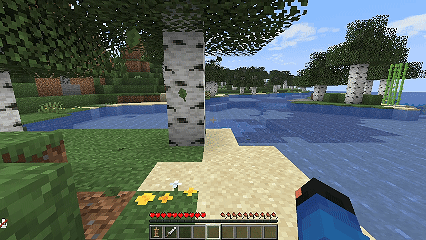

# Стойки для брони

<figure><figcaption>
Демонстрация
</figcaption></figure>

Создавайте статуи, сцены или украшения с большей индивидуальностью, превращая простую стойку для брони в мощный инструмент для творчества и самовыражения. \
Чтобы сменить позу, кликните ПКМ по нижней части стойки для брони.

