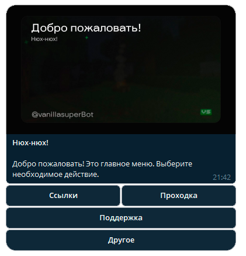

# Как зайти?

### Что такое VanillaSuper?

VanillaSuper — приватный ванильный сервер Minecraft с небольшим, но дружелюбным сообществом игроков. На сервере нет приватов, лишних плагинов и привелегий. Бесплатный доступ через заявку.
&#x20;

Перед началом обязательно прочитайте [Правила](rules.md).

### Первым делом..

1. Подпишитесь на наш [Telegram канал](https://t.me/vanillasuper_ru).
2. Зайдите в бота [Нюхля](https://t.me/vanillasuperBot) и заполните заявку.

<figure><figcaption></figcaption></figure>

1. Дождитесь, пока вашу заявку рассмотрят наши администраторы. С вами могут связаться хелперы напрямую в переписке с ботом и попросить ответить на несколько вопросов. В случае игнорирования заявка будет отклонена.


Если вы не хотите заполнять заявку или она была отклонена, вы можете приобрести проходку, дополнительно поддержав проект.&#x20;


### Как зайти на сервер?

1. Подключитесь к серверу по адресу `vanillasuper.xyz`.
2. Зарегестрируйтесь используя команду '<mark style="color:$success;">/reg <пароль> <повтор пароля></mark>'<mark style="color:$info;">.</mark>

***

* Если у вас лицензионный аккаунт, введите команду '<mark style="color:$success;">/premium</mark>'. После этого вам не нужно будет авторизовываться в аккаунт, но зайти можно будет только с лицензии.
* Если у вас пиратский аккаунт, зайдите в бота '[@vs\_auth\_bot](https://t.me/vs_auth_bot)' и привяжите свой никнейм.

### Частые проблемы

их нет, потому что мы крутой сервер.

***


[administration.md](../o/administration.md)

